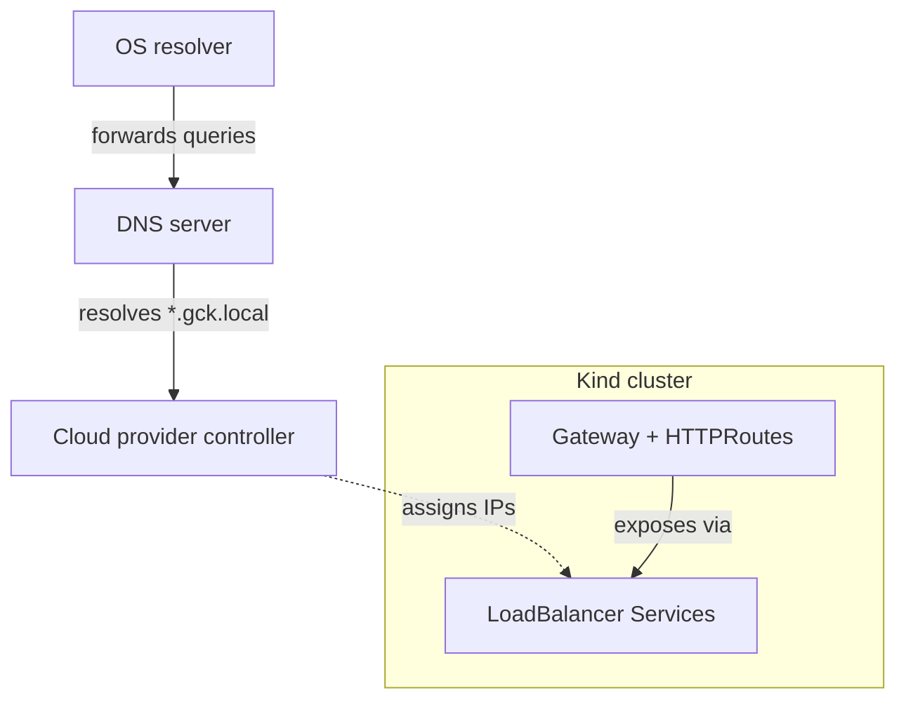

gck gives you production-like networking on your local machine: load balancers, Gateway API support, and automatic DNS resolution. Say goodbye to `/etc/hosts` edits and IP hunting -- services are reachable by name out of the box.



## Load balancers

By default, `LoadBalancer`-type Services in Kind stay in `Pending` state because there's no cloud provider to assign IPs. gck can emulate this with a local cloud provider controller that assigns real IPs from the Docker network range.

Enable it in your `gck.yaml`:

```yaml
features:
  lb:
    enabled: true
```

Once enabled, any Service of type `LoadBalancer` in your cluster gets an external IP that's reachable from your host machine.

> **macOS note:** On macOS, Docker runs inside a lightweight VM, so container networks are not directly routable from the host. gck sets up a packet tunnel to bridge this gap, which requires `sudo` privileges. You will be prompted for your password when creating a cluster with load balancers enabled.

## Gateway API

gck supports the [Kubernetes Gateway API](https://gateway-api.sigs.k8s.io/) for managing ingress traffic. Enabling it automatically enables load balancers too (Gateway controllers need them):

```yaml
features:
  gateway:
    enabled: true
    channel: standard    # or "experimental"
```

This installs the Gateway API CRDs so you can define `Gateway` and `HTTPRoute` resources in your contexts or local manifests.

## Local DNS

gck can run a local DNS server that lets you reach services by hostname (e.g. `api.gck.local`) instead of looking up IPs manually.

### How it works

1. **Record collection** -- After all components are installed, gck introspects the cluster for hostnames. It discovers routes from Gateway API resources (`Gateway` + `HTTPRoute`) and resolves static records you define manually.
2. **DNS server** -- A lightweight DNS server runs in the background, serving A queries for `*.<domain>`. It watches for changes and hot-reloads when records are updated.
3. **OS routing** -- A one-time `gck setup dns` command tells your operating system to forward queries for the gck domain to the local server.

### Enabling DNS

```yaml
features:
  dns:
    enabled: true
```

On the next `gck create`, gck collects records, starts the DNS server, and prints a reminder if OS routing isn't configured yet.

### One-time OS setup

Run this once after enabling DNS:

```bash
gck setup dns
```

This configures your OS to route `*.gck.local` queries to the local DNS server:

- **macOS**: creates `/etc/resolver/gck.local` (persists across reboots)
- **Linux**: configures `systemd-resolved` on the loopback interface (runtime only)

> The setup command requires `sudo` because it writes to system directories: `/etc/resolver/` on macOS, and `systemd-resolved` configuration on Linux. Once done, day-to-day `gck create` and `gck delete` commands run without elevated privileges. To undo, just run `gck teardown dns`.

### Static records

By default, gck discovers hostnames from Gateway API resources. You can also map hostnames to `LoadBalancer` Services explicitly:

```yaml
features:
  dns:
    enabled: true
    records:
      - hostname: api.gck.local
        service: my-api-gateway
        namespace: default
```

### Wildcard records

Wildcard hostnames are supported per [RFC 4592](https://datatracker.ietf.org/doc/html/rfc4592). A `*` first label matches any hostname sharing the remaining suffix:

```yaml
features:
  dns:
    enabled: true
    records:
      - hostname: "*.api.gck.local"
        service: my-gateway
        namespace: default
```

Both `demo.api.gck.local` and `v2.demo.api.gck.local` resolve to the same Service IP. Exact records always take priority over wildcards.

### In-cluster DNS resolution

When DNS is enabled, gck also patches the in-cluster CoreDNS configuration so that pods can resolve `*.gck.local` hostnames. This is essential for flows where both a browser (on the host) and a backend service (in a pod) must use the same hostname -- for example, OAuth/OIDC redirect flows where the authorization server's hostname appears in redirect URIs and token endpoints.

The in-cluster records point to **ClusterIPs** (not the LoadBalancer IPs used by the host DNS server), so pod-to-service traffic stays inside the cluster with no hairpin routing.

This happens automatically during `gck create` and `gck refresh dns`. You can verify the sync status with `gck describe`.

### Refreshing records

If you deploy additional Gateways or Services after `gck create`, re-collect their hostnames with:

```bash
gck refresh dns
```

This updates both the host DNS server records and the in-cluster CoreDNS configuration.

### DNS options

| Field | Default | Description |
|-------|---------|-------------|
| `enabled` | `false` | Enable the DNS feature |
| `domain` | `gck.local` | Domain suffix served by the local DNS server |
| `port` | `15353` | UDP port the DNS server listens on |
| `records` | *(none)* | Static hostname-to-Service mappings |

### Multiple clusters

Each cluster writes its own record file. The DNS server merges records from all clusters, so hostnames from multiple environments are resolvable simultaneously. When a cluster is deleted, only its records are removed.

## Kind port mappings

Port mappings in your `gck.yaml` are merged with those from the context using union semantics, keyed by `(containerPort, protocol)`:

- Ports only in the context are preserved
- Ports only in your config are added
- When both define the same key, your entry wins

```yaml
kind:
  nodes:
    - role: control-plane
      extraPortMappings:
        - containerPort: 9090
          hostPort: 9090
```

This adds port 9090 alongside any ports the context already defines.
