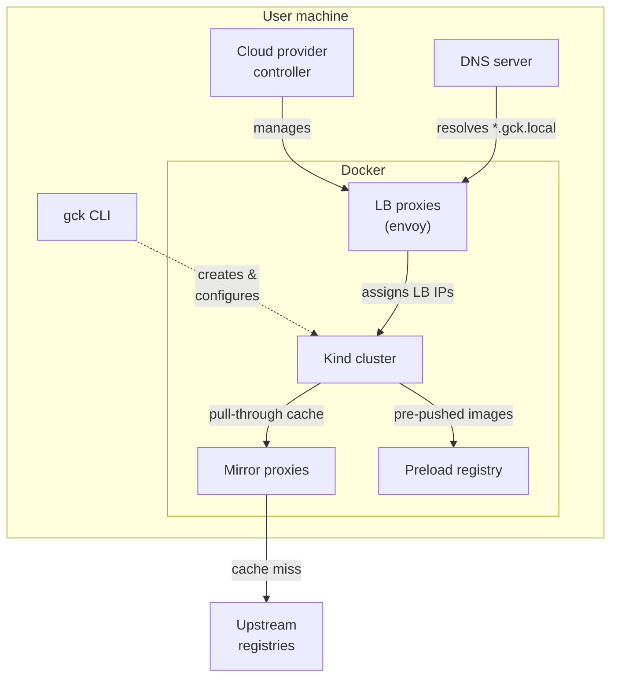
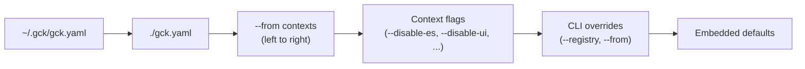
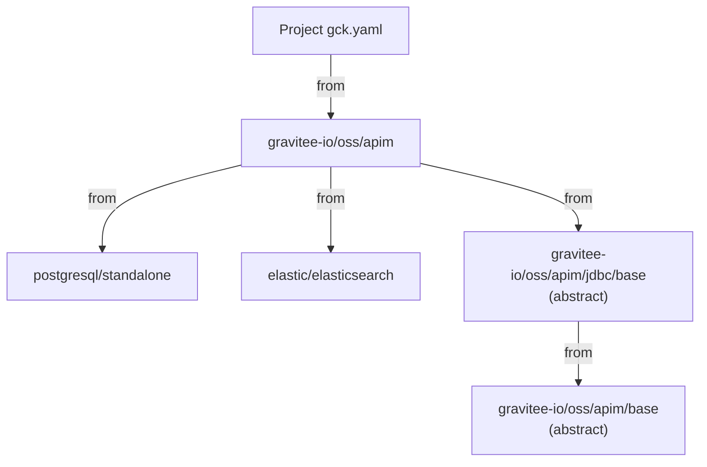

This page describes the structural architecture of gck and how its components interact.

## Component interactions

gck orchestrates several components that run as Docker containers alongside the Kind cluster. Here is how they relate to each other:

**Kind cluster** -- Kubernetes nodes running inside Docker via [Kind](https://kind.sigs.k8s.io/). gck generates the Kind config (node roles, port mappings, containerd patches) and installs Helm charts and raw manifests in dependency order.

**Mirror proxies** -- One `registry:2` container per upstream registry (docker.io, ghcr.io, etc.), configured as pull-through caches. Cached layers persist across cluster lifecycles in `~/.gck/mirrors/`.

**Preload registry** -- A `registry:2` container where gck pushes images pre-pulled on the host. Kind nodes check this registry first, before hitting mirrors or upstream. Data persists in `~/.gck/preload/`.

**Cloud provider controller** -- A host process (`gck cpk serve`) that provides LoadBalancer support on Kind. It creates and manages the LB proxy containers (envoy) inside Docker. When Gateway API is enabled, it also handles the Envoy data-plane.

**LB proxies** -- Docker containers (envoy) created by the cloud provider controller. Each one maps a Kubernetes Service of type LoadBalancer to a routable IP on the host.

**DNS server** -- Resolves `*.gck.local` hostnames to cluster service IPs. It discovers records from Gateway resources and static config, and hot-reloads when records are updated by `gck refresh dns`. Runs on the user machine so that the OS resolver can reach it.

## Config resolution

When gck starts, it assembles a final configuration by merging multiple layers. Each layer overrides the previous one:

The user-level base config (`~/.gck/gck.yaml`) provides personal defaults -- mirror settings, a custom registry URL, or a preferred DNS domain. The project config (`./gck.yaml` or `--config`) layers on top. Registry contexts resolved from `from` entries are merged left to right. Context flags apply last, patching components in or out.

## Context composition

Registry contexts compose other contexts via the `from` field. gck resolves each entry from the registry and merges them into a single stack. A context can itself chain further contexts via its own `from` field, forming a dependency tree.

Here the project pulls in `gravitee-io/oss/apim`, which resolves to the default concrete context (`gravitee-io/oss/apim/jdbc/postgres` via the `.default` chain). That context composes three dependencies: a standalone data store, Elasticsearch, and an abstract JDBC base that adds JDBC persistence on top of the shared APIM configuration. gck walks the full tree, merges every layer, and deduplicates overlapping components.

Abstract contexts (`abstract: true`) cannot be deployed directly -- they exist to capture shared configuration that concrete contexts extend.
